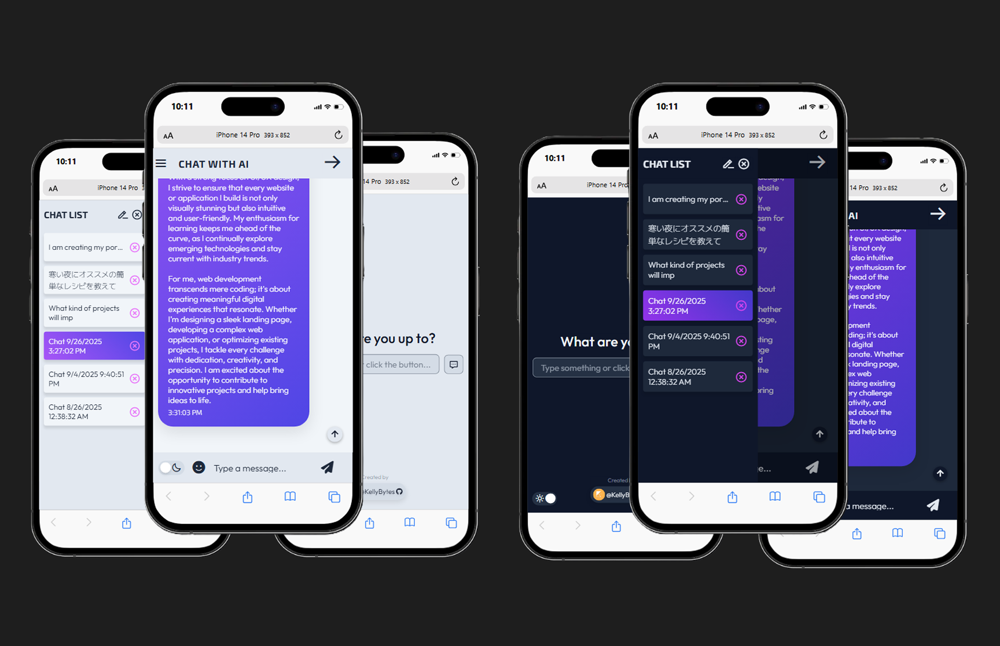

# AI Chatbot App [➚](https://chatbot.kellybytes.dev "Click to launch the AI Chatbot App")

### Screenshots

---

## 💡 Overview

**AI Chatbot App** is a fully responsive, single-page web application built with **ReactJS** and integrated with the **OpenAI API**. It allows users to interact with an AI model (GPT-5-mini), manage multiple chat sessions, and save or delete conversations using **localStorage**. The app includes light/dark theme support, formatted responses for readability, and smooth scrolling for an intuitive user experience. Deployed with **Netlify** using serverless functions.

 

## 🚀 Key Features

- Interactive chat interface powered by the **OpenAI GPT-5-mini** model  
- Persistent chat storage using **localStorage**  
- Create and delete chat sessions  
- **Emoji picker** integration for rich text input  
- Auto-scroll to the most recent message and “scroll to top” button  
- **Light/Dark** theme switching using a `ThemeProvider`  
- Clean and readable response formatting  
- **Responsive UI** for desktop and mobile devices  
- Deployed on **Netlify** with serverless **Netlify Functions**

 

## 🛠 Tech Stack

- **Frontend:** ReactJS (Hooks, Components, useState, useEffect, useRef)
- **Backend / API:** OpenAI API via Netlify Functions
- **Build & Deployment:** Netlify, Netlify CLI
- **Other Tools:** UUID, Emoji Picker, Figma, Git, GitHub

 

## 🧩 What I Learned

- Building a **React-based chat interface** and managing dynamic message rendering  
- Implementing **unique chat IDs** with UUID  
- Integrating and customizing an **Emoji Picker** component  
- Managing global themes by wrapping components with a **ThemeProvider**  
- Applying **useRef** for scroll behavior and DOM manipulation  
- Writing an **outside click** handler for modal and dropdown interactions  
- Configuring **Netlify Functions** to connect React apps with the OpenAI API  
- Running a **local development server** using Netlify CLI  

 

## 📈 Skills Demonstrated🎯

- **Frontend Development:** React, JavaScript (ES6+)
- **API Integration:** RESTful API requests, serverless architecture
- **State Management:** Hooks, localStorage persistence 
- **Responsive Design & Accessibility:** Flexbox, media queries, color themes
- **Deployment:** Netlify, environment variable configuration

 

## ▶ Live Demo

🔗 https://chatbot.kellybytes.dev

---

[🔼 Back to Top](#ai-chatbot-app-)
