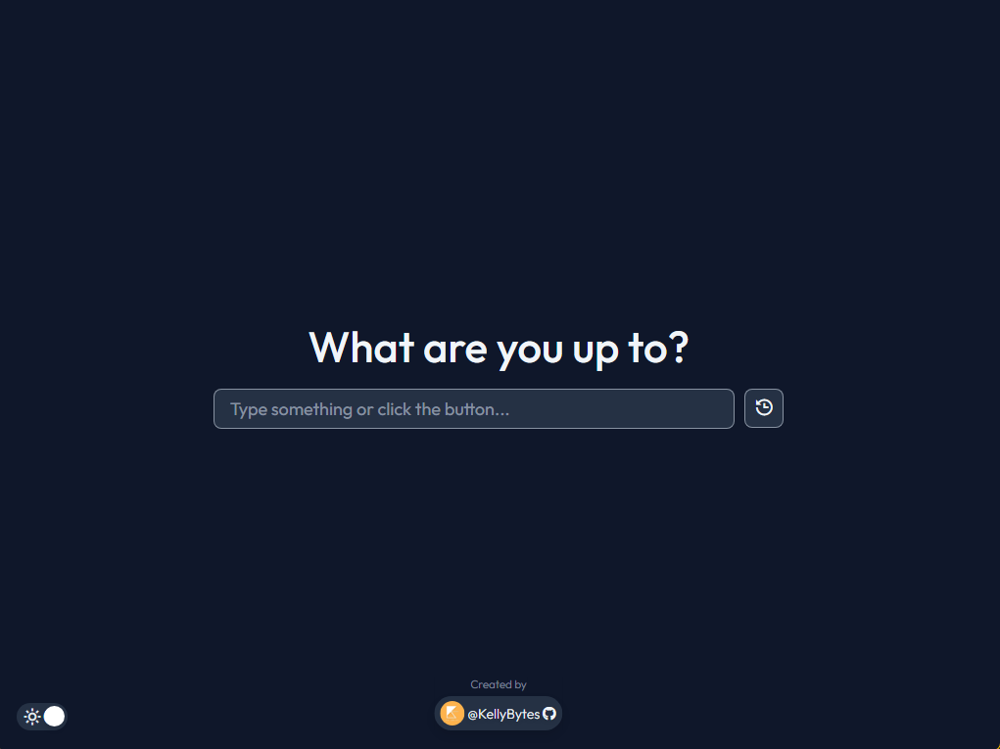
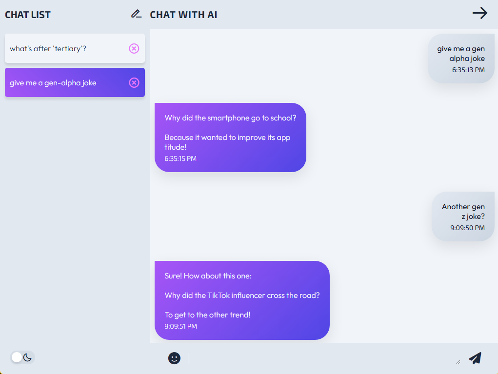
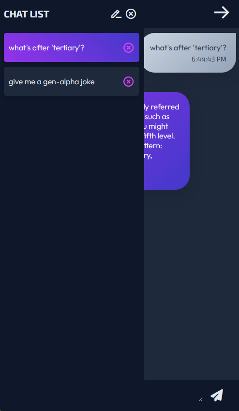
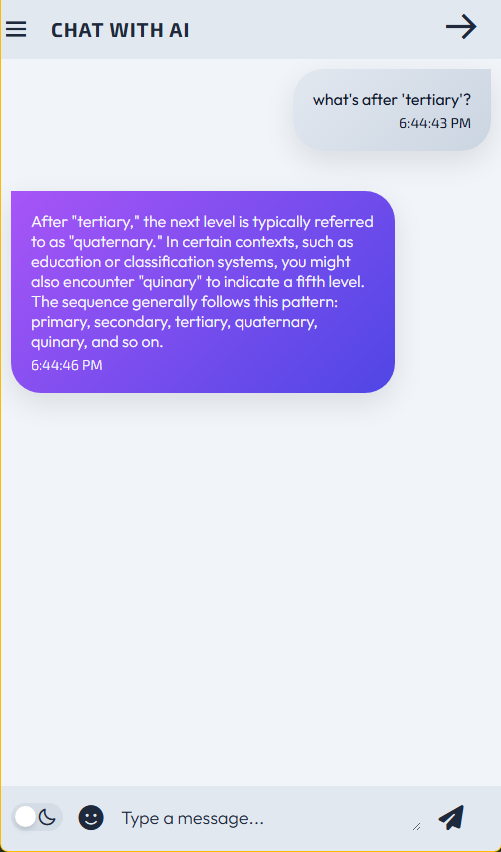

# AI Chat Bot App

## Overview
A responsive chat application powered by the OpenAI API. It automatically saves chat history, with options to delete conversations if desired. Responses are neatly formatted for readability. Supports light/dark mode.

###  Features

- Chat with AI
- Create/delete chats
- Save chats in localStorage
- Emoji picker
- Automatic scroll to the bottom of long chats
- Responsive design
- Light/dark/system mode
- Formatted responses

### Built with
- React
- OpenAI API

---

## Screenshots

<strong>Desktop</strong>

 

<strong>Mobile</strong>

